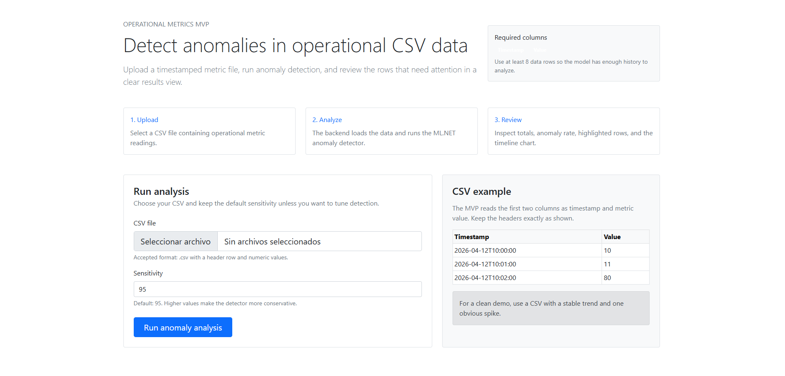
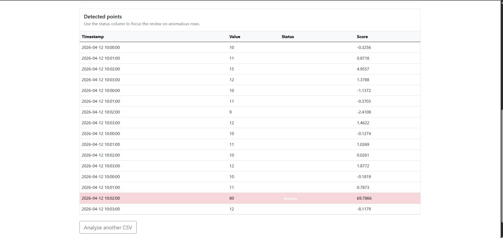

# Open-source software
# Operational Anomaly Detection with ML.NET

A .NET 8 MVP that detects anomalies in operational CSV data using ML.NET and presents the results in a clean ASP.NET Core MVC interface.

## Live Demo
- Azure App Service deployment: [Live Demo](https://operational-anomaly-demo-eduardo-bjajayg4dhcqajcf.eastus-01.azurewebsites.net)

## Overview
This project allows a user to upload a CSV file with operational metrics, run anomaly detection, and review the results through a simple web interface.

The MVP includes:
- CSV upload flow
- anomaly detection with ML.NET
- result summary cards
- anomaly rate
- highlighted rows
- timeline visualization
- Azure deployment

## Screenshots
### Analysis page


### Results page


## Sample CSV

Download the sample file here: [test.csv](samples/test.csv)

## Features
- Upload a CSV file with `Timestamp` and `Value`
- Validate minimum dataset size
- Run anomaly detection using ML.NET
- Display total records, anomalies, and anomaly rate
- Highlight anomaly rows in the UI
- Visualize the metric timeline
- Deployable to Azure App Service

## Architecture
This project follows a layered structure inspired by Clean Architecture:

- **Web**: MVC UI, file upload, result rendering
- **Application**: use case orchestration
- **Domain**: core models and contracts
- **Infrastructure**: CSV loading and model artifact storage
- **ML**: anomaly detection logic with ML.NET

## Tech Stack
- ASP.NET Core MVC
- .NET 8
- C#
- ML.NET
- Azure App Service
- Bootstrap

## Project Structure
```text
OperationalAnomalyDetection.Web
OperationalAnomalyDetection.Application
OperationalAnomalyDetection.Domain
OperationalAnomalyDetection.Infrastructure
OperationalAnomalyDetection.ML
```
## Author
Built by Eduardo Echeverria.
